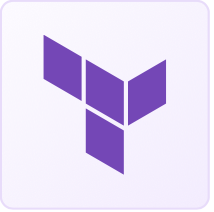

#  Terraform Cheatsheet

## What is Terraform?
Terraform is an Infrastructure as Code tool, that help you `create` and `manage`
BOTH on-prem and cloud resources safely and efficiency.

The most notable feature (vs other IaC tool such as CloudFormation) is it is NOT limited to a single cloud provider.

Written in GO.

## How does Terrafrom work?
Terraform uses plugin call provider to interact with Cloud provider's API.

# P
- [Provider](cheatsheet/provider.md): plugin used to interact with cloud provider, service or infrastructure component.

# S
- [State file](): the file that stores current state of configuration and infrastructure.

# W
- [Workflow](): the core workflow consist of 3 stages
  - Write: define the configuration file
  - Plan (execution plan): review the changes
  - Apply: provision infrastructure

